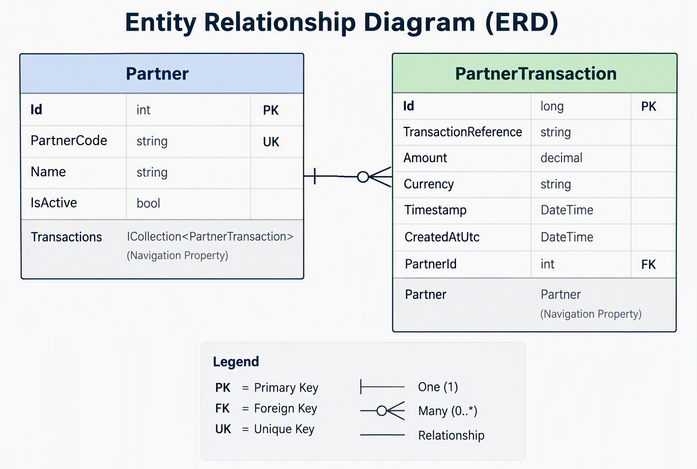

# Partner Integration BFF

## Expanded .NET 8 Interview Preparation Exercise

### Goal

Refresh practical .NET backend engineering skills while deliberately exercising common senior .NET interview topics.

The focus is not building a production-ready system. The goal is to understand and explain architectural decisions, trade-offs, and implementation details.

---

# Scenario

Build a Backend-for-Frontend (BFF) microservice in **.NET 8** that:

1. Receives transaction data from third-party partners.
2. Validates incoming requests.
3. Verifies the partner via an external API.
4. Persists transactions.
5. Reliably publishes messages for downstream legacy processing.

---

# Technical Constraints

- .NET 8 Web API
- ASP.NET Core Dependency Injection
- EF Core with SQLite (preferred) or InMemory provider
- Async APIs for I/O operations
- xUnit or NUnit for testing
- Message broker abstraction (`IMessagePublisher`)
- RabbitMQ recommended
- Intended effort: 3-5 hours

---

# Domain Model

## Partner

| Property | Notes |
|-----------|--------|
| Id | Primary Key |
| PartnerCode | Unique |
| Name | Partner Name |
| IsActive | Active Flag |
| CreatedAtUtc | Audit Field |

## PartnerTransaction

| Property | Notes |
|-----------|--------|
| Id | Primary Key |
| PartnerId | Foreign Key |
| TransactionReference | Unique Reference |
| Amount | Transaction Amount |
| Currency | ISO Currency Code |
| TimestampUtc | Event Timestamp |
| Status | Processing Status |
| CreatedAtUtc | Audit Field |
| ProcessedAtUtc | Nullable Completion Date |

### Relationships




### Requirements

- Configure foreign-key relationship.
- Enforce transaction uniqueness.
- Seed:
  - 2 active partners
  - 1 inactive partner

### Discussion Points

Be ready to explain:

- Primary keys
- Foreign keys
- Indexes
- Unique constraints
- Navigation properties
- Relational design decisions

---

# POST Transactions Endpoint

## Endpoint

```http
POST /api/v1/partner/transactions
```

## Sample Request

```json
{
  "partnerId": "P-1001",
  "transactionReference": "TXN-99823",
  "amount": 250.00,
  "currency": "USD",
  "timestamp": "2024-05-10T14:30:00Z"
}
```

## Validation Rules

- All fields required
- Amount > 0
- Currency must be supported
- Timestamp must be UTC
- TransactionReference must be unique
- Partner must exist
- Partner must be active

Supported currencies:

```text
AUD
USD
EUR
GBP
```

---

# Idempotency

## Requirement

Use:

```text
partnerId + transactionReference
```

as the idempotency key.

### Behaviour

Duplicate requests must:

- Not create another database record
- Not publish another message

### Interview Topics

- What is idempotency?
- Why is idempotency important?
- What happens if two identical requests arrive simultaneously?
- How can database constraints help enforce idempotency?

---

# LINQ Requirements

## Partner Lookup

Use:

```csharp
var partner = await db.Partners
    .SingleOrDefaultAsync(
        p => p.PartnerCode == request.PartnerId,
        cancellationToken);
```

### Why SingleOrDefault?

`SingleOrDefault`:

- Expects exactly one match.
- Throws if duplicates exist.

`FirstOrDefault`:

- Returns first match.
- Ignores duplicate records.

### Interview Discussion

When should you use:

- `Single`
- `SingleOrDefault`
- `First`
- `FirstOrDefault`

---

## Deferred Execution

Create:

```http
GET /api/v1/partner/transactions
```

Example:

```http
GET /api/v1/partner/transactions?partnerId=P-1001&status=Queued&minAmount=100
```

### Query Pipeline

```csharp
IQueryable<PartnerTransaction> query =
    db.PartnerTransactions;

if (!string.IsNullOrWhiteSpace(partnerId))
{
    query = query.Where(
        t => t.Partner.PartnerCode == partnerId);
}

if (minAmount is not null)
{
    query = query.Where(
        t => t.Amount >= minAmount);
}

var results = await query
    .OrderByDescending(t => t.TimestampUtc)
    .Select(t => new TransactionSummaryDto(...))
    .ToListAsync(cancellationToken);
```

### Key Concepts

Deferred:

```csharp
Where()
OrderBy()
Select()
```

Execute Query:

```csharp
ToListAsync()
First()
Single()
Count()
Any()
```

### Interview Discussion

- What is deferred execution?
- When does a query execute?
- What are the risks of multiple enumerations?
- How can deferred execution create surprising behaviour?

---

## IEnumerable vs IQueryable

### IQueryable

Used while querying EF Core.

Benefits:

- SQL translation
- Server-side filtering
- Better performance

### IEnumerable

Used for in-memory collections.

Benefits:

- Simpler processing once data is loaded

### Anti-Pattern

Avoid:

```csharp
var data = await db.Transactions.ToListAsync();

data = data.Where(...);
```

when filtering could occur in SQL.

---

# External Partner Verification API

Create a simulated verification API.

## Behaviour

- Accepts partner code
- ~70% success rate
- ~30% timeout/failure rate

## Requirements

Use:

```text
HttpClient
IHttpClientFactory
```

Do not directly invoke service methods.

---

# Resilience & Retry

Implement bounded retries.

### Topics

- Retry transient failures
- Avoid retrying permanent failures
- Preserve cancellation tokens

### Discussion

Retry:

- Timeouts
- Temporary network issues
- 5xx errors

Usually don't retry:

- Validation failures
- 400 responses
- Bad requests

---

# Dependency Injection

Create the following abstractions:

```csharp
IPartnerVerificationService
ITransactionService
IMessagePublisher
```

## Service Lifetimes

### Transient

New instance every resolution.

### Scoped

One instance per request.

Recommended for:

- Request services
- DbContext

### Singleton

Application lifetime.

Requirements:

- Thread-safe
- Must not depend directly on scoped services

---

# Async/Await

Use async APIs for:

- EF Core
- HTTP requests
- Queue publishing

## Avoid

```csharp
.Result
.Wait()
```

## Interview Discussion

- Task vs Task<T>
- Thread blocking
- Scalability improvements
- I/O bound vs CPU bound work

---

# Asynchronous Messaging

## Requirement

Publish a message after successful validation and verification.

### Message Contents

```json
{
  "transactionId": "...",
  "partnerCode": "...",
  "transactionReference": "...",
  "amount": 250.00,
  "currency": "USD",
  "timestamp": "..."
}
```

### Broker

Recommended:

```text
RabbitMQ
```

### Design Requirement

Hide implementation behind:

```csharp
IMessagePublisher
```

### Constraint

No duplicate message publication.

---

# Reliability Discussion

Understand the failure window:

```text
Database saved
      ↓
Queue publish failed
```

### Be Able to Explain

- Failure scenarios
- Event loss risks
- Transactional Outbox Pattern
- Production-grade reliability

---

# Error Handling

Implement global exception handling.

Recommended response format:

```text
ProblemDetails
```

## Suggested Status Codes

| Scenario | Status |
|-----------|----------|
| Validation Failure | 400 |
| Unknown Partner | 400 / 404 |
| Inactive Partner | 400 / 404 |
| Duplicate Request | Document Choice |
| Verification Unavailable | 503 |
| Unexpected Error | 500 |

### Requirements

- Consistent error format
- No internal implementation leakage

---

# Testing

## Unit Tests

### Validation

- Amount <= 0 rejected
- Unsupported currency rejected
- Missing required fields rejected

### Partner Rules

- Active partner accepted
- Inactive partner rejected
- Unknown partner rejected

### Retry Logic

- Temporary failure eventually succeeds
- Repeated failure returns graceful error

### Idempotency

- Duplicate transaction not saved
- Duplicate transaction not published

### LINQ

- Duplicate partners cause `SingleOrDefault` to expose integrity issues

---

## Integration Test

Perform end-to-end verification using:

```text
WebApplicationFactory
```

Suggested scenarios:

- POST transaction
- Persist entity
- Verify response
- Mock external systems

---

# Optional Extensions

## Infrastructure

- Dockerfile
- docker-compose.yml

## Security

- API Key Authentication
- JWT Authentication

### Discussion

Be able to justify which is better for partner integrations.

## Observability

- Structured logging
- Correlation IDs
- Health checks

## Advanced Design

- Transactional Outbox
- Pagination

---

# Recommended Build Order

1. Create .NET 8 Web API
2. Add EF Core and entities
3. Add validation
4. Implement POST transaction flow
5. Add idempotency
6. Add GET transactions endpoint
7. Add HTTP verification service
8. Add queue publishing
9. Add tests
10. Optional enhancements

---

# Interview Self-Assessment Questions

Be able to answer:

- What is LINQ?
- What is deferred execution?
- When does a LINQ query execute?
- Why use `SingleOrDefault` instead of `FirstOrDefault`?
- `IEnumerable<T>` vs `IQueryable<T>`?
- How does EF Core translate LINQ to SQL?
- What is idempotency?
- Is the implementation safe under concurrency?
- Why is DbContext scoped?
- Transient vs Scoped vs Singleton?
- Why use `IHttpClientFactory`?
- Which failures should be retried?
- Why avoid `.Result` and `.Wait()`?
- Why use an interface around the message broker?
- What failure exists between database save and publish?
- What is the Transactional Outbox Pattern?
- How would you secure a partner integration endpoint?
- What would you monitor in production?
- What would change if traffic increased 100x?
- What was intentionally left out to avoid over-engineering?

---

# Definition of Done

- API runs locally
- Successful transaction can be submitted
- Transaction persistence works
- Queue publication works
- Validation failure demonstrated
- Retry behaviour demonstrated
- Idempotent duplicate demonstrated
- IQueryable LINQ query pipeline demonstrated
- Automated tests pass
- Every design decision can be clearly explained
